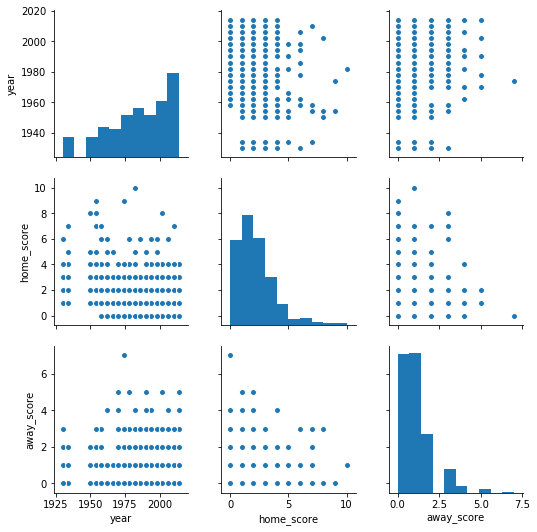

# Paul the Octopus - Challenge (In Progress)


```python
# Import data libraries
import seaborn
import pandas as pd
import matplotlib.pyplot as plt
```


```python
matches_history = pd.read_csv('datasets/matches_history.csv')
matches_wc2018 = pd.read_csv('datasets/matches_world_cup_2018.csv')
```


```python
matches_history.tail()
```


<div>
<style scoped>
    .dataframe tbody tr th:only-of-type {
        vertical-align: middle;
    }

    .dataframe tbody tr th {
        vertical-align: top;
    }

    .dataframe thead th {
        text-align: right;
    }
</style>
<table border="1" class="dataframe">
  <thead>
    <tr style="text-align: right;">
      <th></th>
      <th>year</th>
      <th>home</th>
      <th>home_score</th>
      <th>away_score</th>
      <th>away</th>
    </tr>
  </thead>
  <tbody>
    <tr>
      <th>631</th>
      <td>1978</td>
      <td>Austria</td>
      <td>1</td>
      <td>5</td>
      <td>Netherlands</td>
    </tr>
    <tr>
      <th>632</th>
      <td>2014</td>
      <td>Spain</td>
      <td>1</td>
      <td>5</td>
      <td>Netherlands</td>
    </tr>
    <tr>
      <th>633</th>
      <td>1970</td>
      <td>Bulgaria</td>
      <td>2</td>
      <td>5</td>
      <td>West Germany</td>
    </tr>
    <tr>
      <th>634</th>
      <td>1990</td>
      <td>United States</td>
      <td>1</td>
      <td>5</td>
      <td>Czechoslovakia</td>
    </tr>
    <tr>
      <th>635</th>
      <td>1974</td>
      <td>Haiti</td>
      <td>0</td>
      <td>7</td>
      <td>Poland</td>
    </tr>
  </tbody>
</table>
</div>


```python
matches_wc2018.tail()
```


<div>
<style scoped>
    .dataframe tbody tr th:only-of-type {
        vertical-align: middle;
    }

    .dataframe tbody tr th {
        vertical-align: top;
    }

    .dataframe thead th {
        text-align: right;
    }
</style>
<table border="1" class="dataframe">
  <thead>
    <tr style="text-align: right;">
      <th></th>
      <th>date</th>
      <th>home</th>
      <th>away</th>
    </tr>
  </thead>
  <tbody>
    <tr>
      <th>43</th>
      <td>17 June 2018 21:00 MSK (UTC+3)</td>
      <td>Brazil</td>
      <td>Switzerland</td>
    </tr>
    <tr>
      <th>44</th>
      <td>22 June 2018 20:00 KALT (UTC+2)</td>
      <td>Serbia</td>
      <td>Switzerland</td>
    </tr>
    <tr>
      <th>45</th>
      <td>20 June 2018 18:00 MSK (UTC+3)</td>
      <td>Uruguay</td>
      <td>Saudi Arabia</td>
    </tr>
    <tr>
      <th>46</th>
      <td>14 June 2018 18:00 MSK (UTC+3)</td>
      <td>Russia</td>
      <td>Saudi Arabia</td>
    </tr>
    <tr>
      <th>47</th>
      <td>18 June 2018 15:00 MSK (UTC+3)</td>
      <td>Sweden</td>
      <td>Korea Republic</td>
    </tr>
  </tbody>
</table>
</div>


### See data plots to help get more insights.


```python
seaborn.pairplot(matches_history)
plt.show()
```




